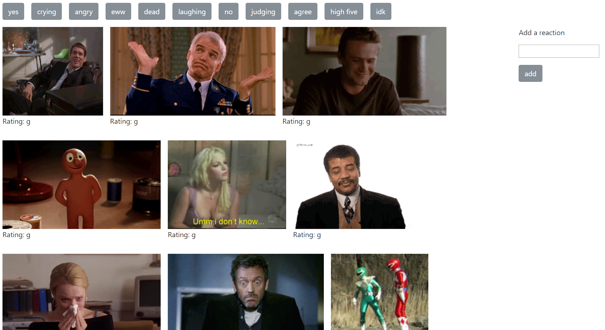

# Reaction GIF Generator
Generates reaction gifs using the provided reactions or add your own, with help from the Giphy API

# Screenshot

# How It Works
Click on one of the reactions at the top of the page to generate the most popular GIFs for that reaction. The gifs can be paused and un-paused by clicking on them. Add your own reaction by typing your reaction into the "add a reaction" box and clicking "add". The reaction will now show up as a button on the top of the page.

# Technologies Used
* Bootstrap
* JQuery
* Giphy API